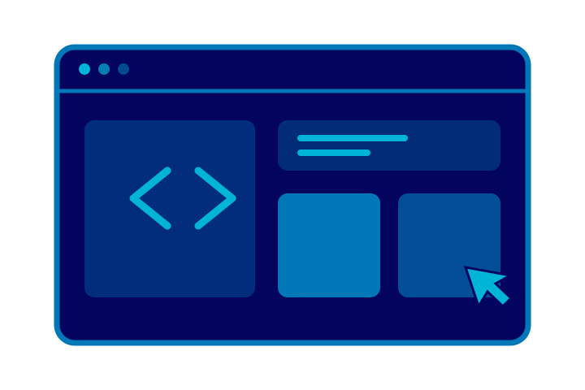
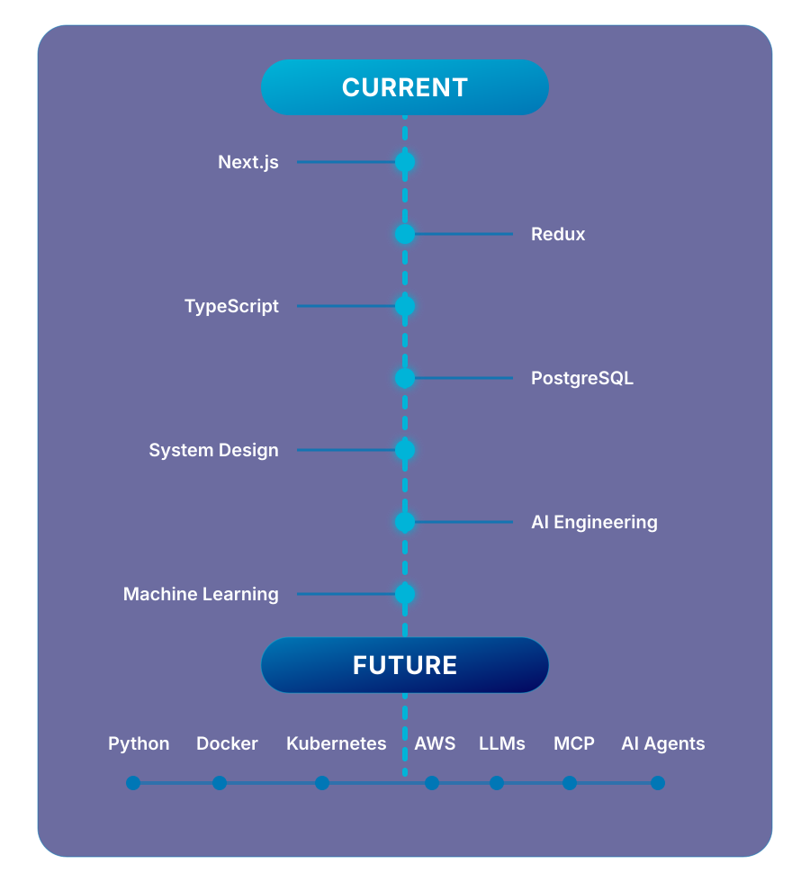
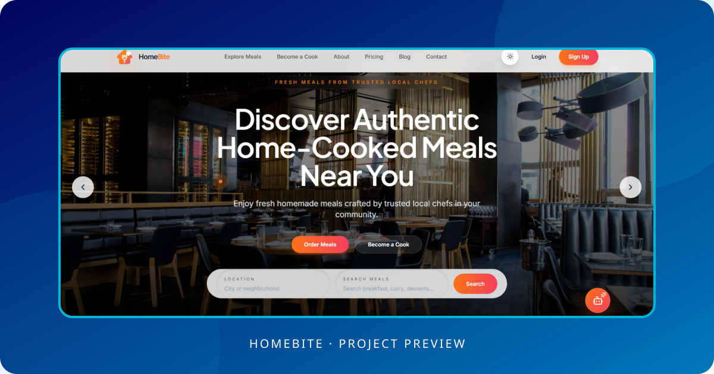
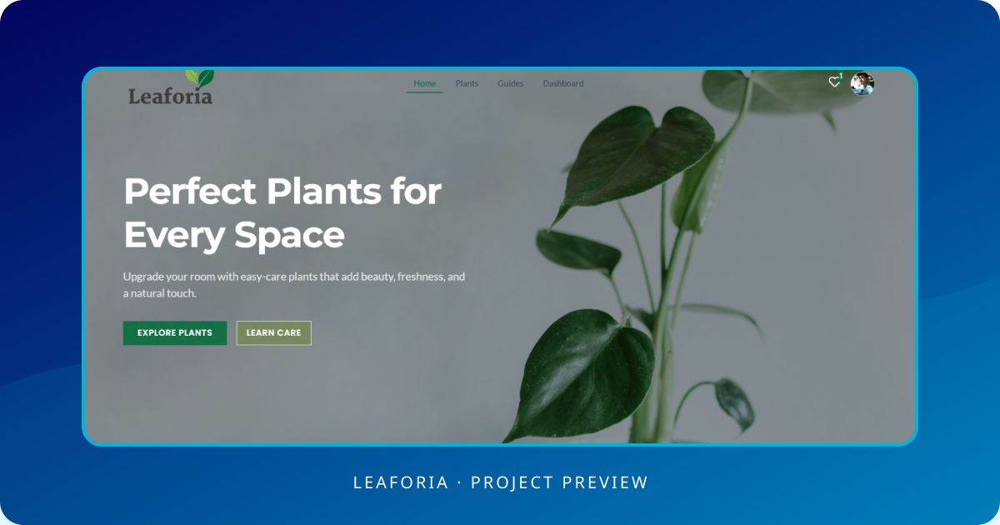
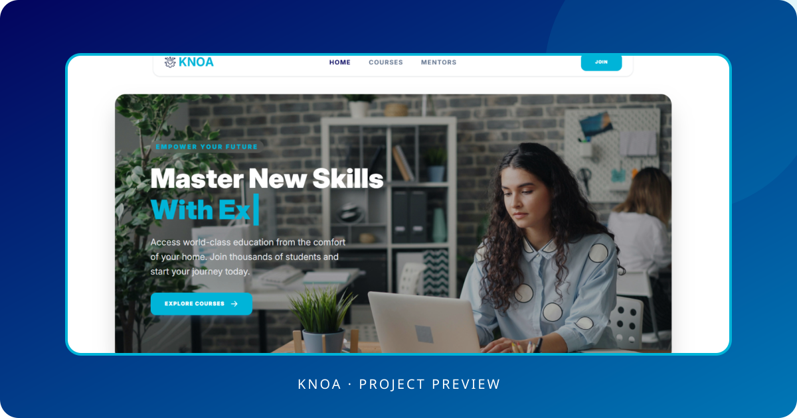
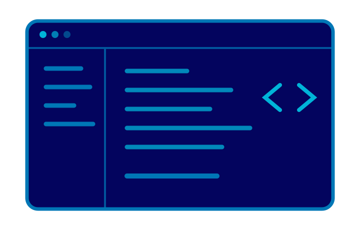

<header align="center">

 

<h1>Sristi Kundu</h1>

<strong>Frontend Developer · MERN Stack Enthusiast</strong>

Dhaka, Bangladesh

 

 

  

</header>

<section id="visitor-badge" align="center">

</section>

---

<section id="about">

## About Me

I'm **Sristi Kundu**, a frontend developer with **1+ year of professional experience** building real-world web applications people can actually use. I work mainly with React and JavaScript, and I enjoy taking an idea from a rough screen to a responsive, working product.

The part I like most is figuring things out—whether that means untangling a UI problem, connecting a frontend to an API, or finding a simpler way to build a feature. I enjoy learning as I go, and I regularly build projects outside work to try new ideas and strengthen the parts of development I want to understand better.

My next goal is to grow into a **full-stack developer** who can confidently work across an entire application. In the long run, I want to become an **AI engineer** and build intelligent products on top of that full-stack foundation.

### Current stack

`React` · `JavaScript` · `HTML` · `CSS` · `Tailwind CSS` · `Node.js` · `Express` · `MongoDB` · `Firebase` · `JWT` · `Stripe`

</section>

---

<section id="journey">

## Engineering Roadmap

A focused path from full-stack foundations to intelligent, production-ready systems.

  

### Current

`Next.js` · `Redux` · `TypeScript` · `PostgreSQL` · `System Design` · `AI Engineering` · `Machine Learning`

### Future

`Python` · `Docker` · `Kubernetes` · `AWS` · `LLMs` · `MCP` · `AI Agents`

</section>

---

<section id="tech-stack">

## Tech Stack

Technologies I use to design, build, and ship applications.

  

### Frontend

<picture>
  <source media="(prefers-color-scheme: dark)" srcset="https://skillicons.dev/icons?i=html,css,js,react,tailwind&amp;theme=dark&amp;perline=5" />
  <source media="(prefers-color-scheme: light)" srcset="https://skillicons.dev/icons?i=html,css,js,react,tailwind&amp;theme=light&amp;perline=5" />
  
</picture>

### Backend

<picture>
  <source media="(prefers-color-scheme: dark)" srcset="https://skillicons.dev/icons?i=nodejs,express&amp;theme=dark&amp;perline=2" />
  <source media="(prefers-color-scheme: light)" srcset="https://skillicons.dev/icons?i=nodejs,express&amp;theme=light&amp;perline=2" />
  
</picture>

### Database

<picture>
  <source media="(prefers-color-scheme: dark)" srcset="https://skillicons.dev/icons?i=mongodb,firebase&amp;theme=dark&amp;perline=2" />
  <source media="(prefers-color-scheme: light)" srcset="https://skillicons.dev/icons?i=mongodb,firebase&amp;theme=light&amp;perline=2" />
  
</picture>

### Tools

<picture>
  <source media="(prefers-color-scheme: dark)" srcset="https://skillicons.dev/icons?i=git,github,vscode,figma&amp;theme=dark&amp;perline=4" />
  <source media="(prefers-color-scheme: light)" srcset="https://skillicons.dev/icons?i=git,github,vscode,figma&amp;theme=light&amp;perline=4" />
  
</picture>

### Deployment

<picture>
  <source media="(prefers-color-scheme: dark)" srcset="https://skillicons.dev/icons?i=firebase,vercel,netlify&amp;theme=dark&amp;perline=3" />
  <source media="(prefers-color-scheme: light)" srcset="https://skillicons.dev/icons?i=firebase,vercel,netlify&amp;theme=light&amp;perline=3" />
  
</picture>

### AI

<picture>
  <source media="(prefers-color-scheme: dark)" srcset="https://skillicons.dev/icons?i=py,tensorflow&amp;theme=dark&amp;perline=2" />
  <source media="(prefers-color-scheme: light)" srcset="https://skillicons.dev/icons?i=py,tensorflow&amp;theme=light&amp;perline=2" />
  
</picture>

### Current Learning

<picture>
  <source media="(prefers-color-scheme: dark)" srcset="https://skillicons.dev/icons?i=ts,nextjs&amp;theme=dark&amp;perline=2" />
  <source media="(prefers-color-scheme: light)" srcset="https://skillicons.dev/icons?i=ts,nextjs&amp;theme=light&amp;perline=2" />
  
</picture>

</section>

---

<section id="ai-tools">

## AI-Assisted Development

### Tools I Work With

`Claude Code` · `ChatGPT` · `Codex` · `Cursor` · `GitHub Copilot` · `Gemini`

AI assists my workflow by helping me explore options and move from an idea to a testable solution more efficiently. I use it for **debugging**, **refactoring**, **documentation**, **architecture planning**, **rapid prototyping**, and **automation**—especially when I need to compare approaches, investigate an unfamiliar problem, or reduce repetitive work.

I also work with **prompt engineering** and **LLM integration** to turn broad requirements into useful, structured outputs and add AI capabilities to applications. The goal is not to generate more code; it is to make better decisions and spend more time on the parts of a problem that require judgment.

> **AI supports my engineering process; it does not replace it.** I validate every generated solution, check the assumptions behind it, test the behavior, and adapt the result to the project. I never blindly copy AI-generated code.

</section>

---

<section id="featured-projects">

## Featured Projects

Selected full-stack applications built around real users, workflows, and problems.

 

<table width="100%">
<tr>
<td>

<h3 align="center">HomeBite</h3>

A full-stack marketplace connecting local home chefs with customers looking for fresh homemade meals.

<strong>Key features</strong>
<ul>
  <li>Secure ordering, cart management, and Stripe checkout</li>
  <li>Real-time chef chat, notifications, and order tracking</li>
  <li>Role-based customer, chef, and admin dashboards</li>
</ul>

<strong>Stack:</strong> React · Tailwind CSS · Node.js · Express · MongoDB · Firebase · Stripe · Socket.IO · Gemini

  
  

</td>
</tr>
</table>

 

<table width="100%">
<tr>
<td>

<h3 align="center">Leaforia</h3>

A full-stack indoor-plant marketplace that brings shopping, plant-care content, and community interaction into one experience.

<strong>Key features</strong>
<ul>
  <li>Plant wishlist, purchasing, and order tracking</li>
  <li>Plant-care articles with a dynamic comment system</li>
  <li>Secure inventory, order, user, and analytics dashboard</li>
</ul>

<strong>Stack:</strong> React · Tailwind CSS · Node.js · Express · MongoDB · Firebase · Stripe · EmailJS

  
  

</td>
</tr>
</table>

 

<table width="100%">
<tr>
<td>

<h3 align="center">Knoa</h3>

An AI-powered learning platform connecting students, mentors, and administrators through secure role-based workflows.

<strong>Key features</strong>
<ul>
  <li>Course creation, enrollment, and approval workflows</li>
  <li>Stripe payments with protected course access</li>
  <li>Gemini-powered course guidance and platform assistance</li>
</ul>

<strong>Stack:</strong> React · Tailwind CSS · TanStack Query · Node.js · Express · MongoDB · Firebase · Stripe · Gemini

  
  

</td>
</tr>
</table>

</section>

---

<section id="github-dashboard">

## GitHub Dashboard

<picture>
  <source media="(prefers-color-scheme: dark)" srcset="https://github-stats-extended.vercel.app/api?username=sristikundu1&amp;show_icons=true&amp;include_all_commits=true&amp;hide_border=true&amp;theme=github_dark&amp;title_color=00b4d8&amp;icon_color=00b4d8" />
  <source media="(prefers-color-scheme: light)" srcset="https://github-stats-extended.vercel.app/api?username=sristikundu1&amp;show_icons=true&amp;include_all_commits=true&amp;hide_border=true&amp;theme=default&amp;title_color=0077b6&amp;icon_color=00b4d8" />
  
</picture>
<picture>
  <source media="(prefers-color-scheme: dark)" srcset="https://github-stats-extended.vercel.app/api/top-langs/?username=sristikundu1&amp;layout=compact&amp;langs_count=8&amp;card_width=320&amp;hide_border=true&amp;theme=github_dark&amp;title_color=00b4d8" />
  <source media="(prefers-color-scheme: light)" srcset="https://github-stats-extended.vercel.app/api/top-langs/?username=sristikundu1&amp;layout=compact&amp;langs_count=8&amp;card_width=320&amp;hide_border=true&amp;theme=default&amp;title_color=0077b6" />
  
</picture>

  

<picture>
  <source media="(prefers-color-scheme: dark)" srcset="https://streak-stats.demolab.com?user=sristikundu1&amp;theme=github-dark-blue&amp;hide_border=true&amp;ring=00B4D8&amp;fire=0077B6&amp;currStreakLabel=00B4D8" />
  <source media="(prefers-color-scheme: light)" srcset="https://streak-stats.demolab.com?user=sristikundu1&amp;theme=default&amp;hide_border=true&amp;ring=0077B6&amp;fire=00B4D8&amp;currStreakLabel=0077B6" />
  
</picture>

  

<picture>
  <source media="(prefers-color-scheme: dark)" srcset="https://github-trophies.vercel.app/?username=sristikundu1&amp;theme=algolia&amp;no-frame=true&amp;no-bg=true&amp;margin-w=8&amp;row=1&amp;column=6" />
  <source media="(prefers-color-scheme: light)" srcset="https://github-trophies.vercel.app/?username=sristikundu1&amp;theme=flat&amp;no-frame=true&amp;no-bg=true&amp;margin-w=8&amp;row=1&amp;column=6" />
  
</picture>

</section>

---

<section id="contribution-graph">

## Contribution Graph

<picture>
  <source media="(prefers-color-scheme: dark)" srcset="https://github-readme-activity-graph.vercel.app/graph?username=sristikundu1&amp;theme=github-dark&amp;hide_border=true&amp;area=true&amp;color=00b4d8&amp;line=0077b6&amp;point=00b4d8" />
  <source media="(prefers-color-scheme: light)" srcset="https://github-readme-activity-graph.vercel.app/graph?username=sristikundu1&amp;theme=github-light&amp;hide_border=true&amp;area=true&amp;color=03045e&amp;line=0077b6&amp;point=00b4d8" />
  
</picture>

</section>

---

<section id="snake-animation">

## Contribution Snake

<picture>
  <source media="(prefers-color-scheme: dark)" srcset="https://raw.githubusercontent.com/sristikundu1/sristikundu1/output/github-contribution-grid-snake-dark.svg" />
  <source media="(prefers-color-scheme: light)" srcset="https://raw.githubusercontent.com/sristikundu1/sristikundu1/output/github-contribution-grid-snake.svg" />
  
</picture>

</section>

---

<section id="development-philosophy">

## Development Philosophy

I aim to build software that is clear to work with today and dependable enough to change tomorrow. That means understanding the problem first, choosing the simplest design that meets the real requirements, and leaving the codebase easier to navigate than I found it.

- **Clean code:** I use clear names, focused components, and predictable data flow. Readability matters because code is maintained far more often than it is first written.

- **Scalable code:** I separate responsibilities and define stable boundaries between features, services, and data. I avoid premature abstraction, but I make deliberate choices where future change is likely.

- **Accessibility:** I treat semantic structure, keyboard navigation, focus states, readable contrast, and useful labels as part of the product—not as optional polish.

- **Maintainability:** I prefer consistent patterns, small interfaces, useful documentation, and dependencies that earn their place. A solution should be understandable without relying on the original author.

- **Problem solving:** I reproduce the issue, identify the constraints, and work from evidence before changing code. I compare trade-offs instead of reaching for the first solution that appears to work.

- **Testing:** I test critical user flows, failure paths, and risky edge cases. Tests should protect behavior and make refactoring safer, rather than mirror implementation details.

- **Performance:** I measure before optimizing. I pay attention to network requests, rendering work, asset size, and perceived responsiveness, then address the bottlenecks that affect users.

- **Continuous learning:** I use documentation, small experiments, code reviews, and project retrospectives to improve how I work. New tools are useful when they solve a real problem, not simply because they are new.

- **AI-assisted development:** I use AI to explore approaches, debug, refactor, document, and automate repetitive work. Every suggestion is reviewed, understood, adapted to the codebase, and tested before I rely on it.

</section>
